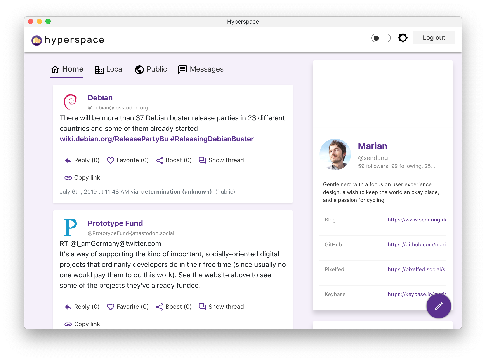

# Web-Oberfläche, Apps und Clients

**Hier erfährst Du, welche Möglichkeiten es gibt, um am PC, am Smartphone und sonstwie mit Mastodon zu interagieren.**

## Die Web-Oberfläche

Mastodon verfügt über eine eigene Web-Oberfläche. Um diese zu erreichen, genügt es, die URL der Instanz zu kennen. Bei uns ist das:

https://gruene.social

Diese Webanwendung, oder das Web User Interface (UI), sind sowohl mit Desktop-Browsern am PC als auch mit gängigen Browsern auf dem Smartphone nutzbar.

Weil Mastodon auf dem offenen Standard [ActivityPub](activitypub.md) aufbaut, gibt es eine Reihe von Möglichkeiten, mit spezialisierten Anwendungen Beiträge zu erstellen, zu veröffentlichen, zu favorisieren und zu boosten, Nutzern\*innen zu folgen etc.

## Mobile Apps

Hier listen wir einige Anwendungen, die im Umfeld der Nutzer\*innen von GRUENE.SOCIAL bereits getestet wurden. Weitere findest Du auf der Seite [Mobile Apps](https://joinmastodon.org/apps) der offiziellen Mastodon-Website.

**Wichtig**: Diese Anwendungen sind nicht Teil des Mastodon-Projekts. Daher werden neue Funktionalitäten und Verbesserungen meist zuerst in der Web-Oberfläche von Mastodon zu finden sein.

### Android

- [**Tusky**](https://tusky.app/) - Die momentan wohl bewährteste Android-App, Open Source und neben dem [Google Play Store](https://play.google.com/store/apps/details?id=com.keylesspalace.tusky&utm_source=github&pcampaignid=MKT-Other-global-all-co-prtnr-py-PartBadge-Mar2515-1) auch über [F-Droid](https://f-droid.org/repository/browse/?fdid=com.keylesspalace.tusky) erhältlich.

### iOS

- [**Amaroq**](https://github.com/ReticentJohn/Amaroq) - Kostenlose, quelloffene App für das iPhone und iPad ([App Store](https://apps.apple.com/de/app/amaroq-for-mastodon/id1214116200)).

### Sailfish OS

- [**Tooter**](https://github.com/dysk0/harbour-tooter) - Open Source ([OpenRepos](https://openrepos.net/content/dysko/tooter))

## Desktop-Clients

Hier sollen nur beispielhaft einige Desktop-Anwendungen genannt werden, die aufzeigen, welche zusätzlichen Funktionalitäten und Vorteile diese bieten können. 

Grundsätzlich gilt auch hier, dass diese als Anwendungen von Drittanbietern generall nicht immer auf dem letzten Stand der Funktionalitäten des Mastodon-Projekts sind. Dafür können Sie Vorteile bieten, die die Weboberfläche prinzipell nicht bieten kann, wie zum Beispiel die Unterstützung mehrerer Instanzen und Nutzer\innenprofile.

### [**Whalebird**](https://whalebird.org/)

Open Source Client für Windows, Mac OS und Linux, unterstützt neben Mastodon auch [Pleroma](https://pleroma.social/). ([Whalebird Website](https://whalebird.org/))

### [**Hyperspace**](https://hyperspace.marquiskurt.net/)

Open Source Client für Windows, Mac. Eigentlich eine Web-Anwendung, für die es auch einen Desktop-Installer im Beta-Stadium gibt. ([Hyperspace Website](https://hyperspace.marquiskurt.net/))
