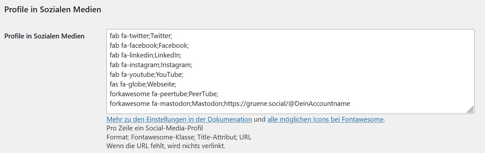
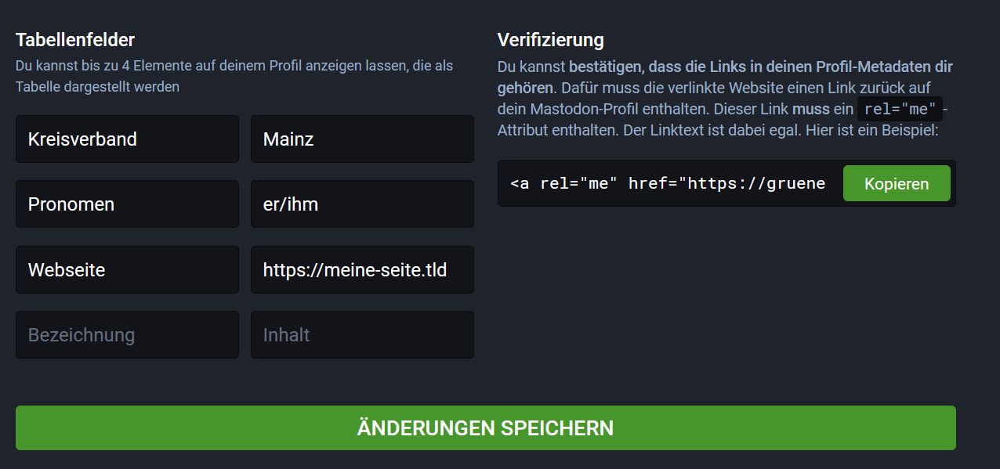
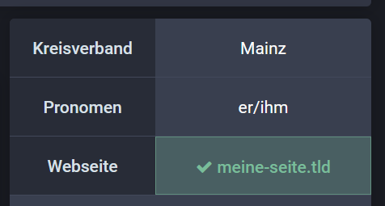

# Link Verifizierung

**Hier erfährst du, wie Verifizierungen bei Mastodon funktionieren und wie du Links verifizieren kannst.**

Bei Mastodon gibt es keine zentrale Instanz, welche Accounts verifizieren kann. Dennoch kannst du mithilfe der Linkverifizierung deinen Account mit deiner Webseite verknüpfen und so zusätzliches Vertrauen aufbauen.

Dabei bestätigst du, dass die von dir in deinem Mastodon-Profil angegebene Webadresse dir gehört.

## Einrichtung

### Auf deiner Webseite

Füge deiner Webseite einen Link zu deinem Mastodon-Profil hinzu. Dieser muss folgende Form haben: `<a rel="me" href="https://gruene.social/@DeinAccountname">Dein Anzeigetext</a>`

Wichtig: Der Link muss zwingend den Teil `rel="me"` beinhalten.

Wenn du das WordPress-Theme sunflower nutzt, kannst du in den Einstellungen unter "Sunflower" -> "Profile in den sozialen Medien" einfach die Zeile `forkawesome fa-mastodon;Mastodon;https://gruene.social/@DeinAccountname` hinzufügen, dann wird ein korrekter Link am Seitenende erzeugt.

### In deinem Mastodon-Profil

Nachdem du den Link zu deiner Webseite hinzugefügt hast, gehst du in die Einstellungen von Mastodon. Unter [Profil](https://gruene.social/settings/profile) kannst du nun bis zu 4 Tabellenfelder befüllen. Gib hier deine Webseite ein.

Nach dem Speichern wird der Link zu deiner Webseite in grün mit einem Häkchen dargestellt.

