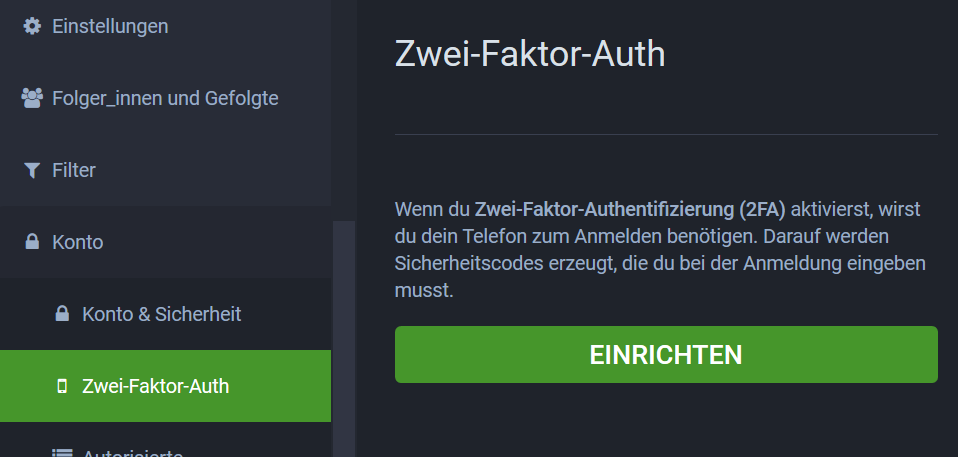
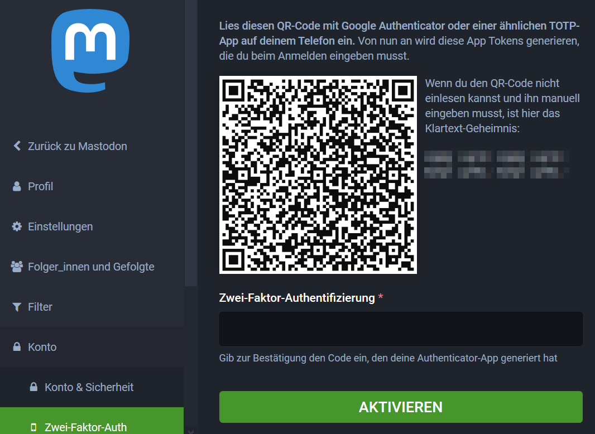
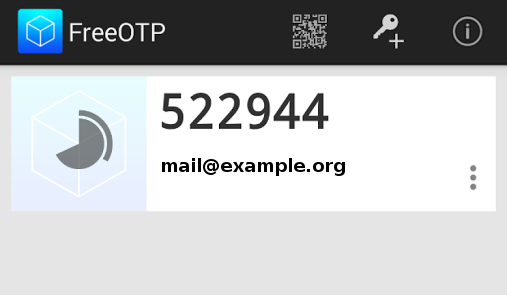
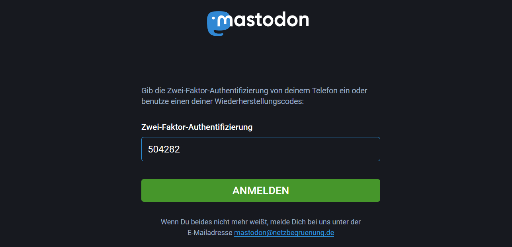

# Zwei-Faktor-Authentifizierung

**Hier erfährst Du, was Zwei-Faktor-Authentifizierung ist und wie Du sie in Mastodon aktivieren kannst, um Dein Benutzerkonto auf GRUENE.SOCIAL zu schützen.**

Mit der Zwei-Faktor-Authentifizierung (2FA) kannst du deinen Account zusätzlich absichern. Du benötigst dafür zwei Dinge: 
* etwas, was du weißt (dein Passwort)
* etwas, das du hast (z.B. dein Smartphone)

Mit dem Smartphone kannst du sogenannte Token (Zahlen-Codes) generieren, die jeweils für 30 Sekunden gültig sind.

## Mobile Anwendungen

Um 2FA nutzen zu können, benötigst du eine Anwendung auf deinem Smartphone, um die passenden Token generieren zu können. In dieser Anleitung wird FreeOTP genutzt, es gibt aber auch weitere Anwensungen (z.B. Google Authenticator)

### Android

- **FreeOTP** - kostenlos und quelloffen, im [Google Play Store](https://play.google.com/store/apps/details?id=org.fedorahosted.freeotp&hl=de) und über [F-Droid](https://f-droid.org/en/packages/org.fedorahosted.freeotp/) erhältlich.

### iOS

- **FreeOTP** - Kostenlose, quelloffene App für das iPhone und iPad ([App Store](https://apps.apple.com/us/app/freeotp-authenticator/id872559395)).

## Einrichtung

Gehe in die [Einstellungen deines Mastodon-Accounts](https://gruene.social/settings/two_factor_authentication) und klicke erst auf "Konto", dann auf "Zwei-Faktor-Auth". Betätige den "Einrichten"-Button.

Du bekommst nun einen QR-Code, den du mit deiner 2FA-App auf dem Smartphone scannen musst. Oben in der App ist dazu ein kleines QR-Code-Symbol.

Sobald der QR-Code erkannt wurde, ist ein neuer Eintrag in der App. Wenn du ihn antippst, siehts du den aktuellen Code und wie lange es daurt, bis der nächste generiert wird.

Um die Einrichtung von 2FA abzuschließen, musst du in Mastodon das aktuelle Token in das Feld unterhalb des QR-Codes eingeben und auf "Aktivieren" klicken

Zum Abschluss bekommst du noch Codes zur Wiederherstellung. Diese sind zeitlich unbegrenzt gültig und helfen dir, wieder Zugriff auf deinen Account zu bekommen, falls du dein Smartphone verlierst oder die App löschst.

Ab sofort wirst du beim Einloggen nach der Eingaben deiner Mail-Adresse und deines Passworts nach dem aktuellen Token gefragt.

## Deaktivierung

Die Zwei-Faktor-Authentifizierung kann unter "Einstellungen" -> "Konto" -> Zwei-Faktor-Auth" wieder deaktiviert werden. Dazu musst du das aktuelle Token eingeben und auf "Deaktivieren" klicken.
