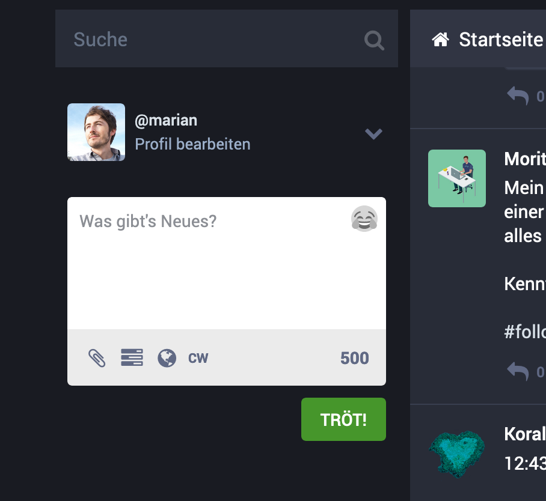
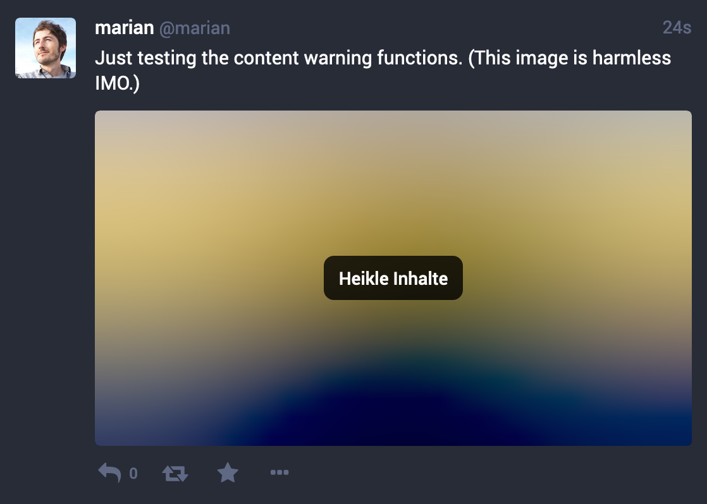

# Mediendateien anhängen

**Hier erfährst Du, wie Du Bilder, Ton und Video teilen kannst.**

## Bilder

Du kannst einer Nachricht ein Bild oder mehrere Bilder anhängen. Das nachstehende Beispiel zeigt einen Toot mit vier Bildern.

### Bild einfügen über den Datei-Dialog

In der Web-Oberfläche von Mastodon findest Du unterhalb des Eingabefelds für den Nachrichtentext ein Büroklammer-Symbol.

Ein Klick darauf öffnet einen Dateiauswahl-Dialog Deines Betriebssystems. Damit wählst Du die Datei(en) aus, die Du teilen möchtest.

### Bild einfügen über die Zwischenablage

Alternativ kannst Du Bilder auch direkt aus der **Zwischenablage** einfügen. Setze dazu die Eingabemarke in das Textfeld und benutze den Tastaturbefehl, den Dein Betriebssystem Dir zur Verfügung stellt (z. B. `Strg + V` unter Windows, `Cmd + V` unter Mac OS) oder Benutze das Kontextmenü im Eingabefeld (meist über Rechtsklick erreichbar) und rufe die Funktion _Einfügen_ auf.

### Drag and Drop

Sofern das Betriebssystem und der Browser dies unterstützen, können Dateien auch direkt per _Drag and Drop_ hinzugefügt werden.

Nach Einfügen eines Bildes stehen weitere Funktionen zur Verfügung. Diese werden sichtbar, sobald man den Mauszeiger über das neu hinzugefügte Vorschaubild bewegt.

### Bildausschnitt von Vorschaubildern bearbeiten

Über die Funktion **Vorschaubild bearbeiten** kann man festlegen, welcher Teil des Bildmotivs in jedem Fall angezeigt werden soll, falls das Bild aufgrund seines Seitenverhältnisses nicht in den vorhandenen Raum für die Darstellung passt.

Unser Beispiel zeigt ein eigentlich quadratisches Bild, das jedoch in einem Toot mit einem Vorschaubild im Format 16:9 dargestellt wird. Da Mastodon nicht weiß, dass sich im oberen Teil des Motivs der Kopf einer Person befindet, schneidet es gleichermaßen oben wie unten Bildinhalte ab.

Durch Klick auf **Vorschaubild bearbeiten** kannst Du den Fokus auf einen bestimmten Bildteil legen, sodass dieser Teil beim Beschneiden erhalten bleibt.

Dazu klickst Du einmal dort ins Bild, wo sich der wesentliche Teil des Motivs befindet. Danach kannst Du die Ansicht durch Drücken der `ESC`-Taste oder durch Klicken außerhalb des Bildes beenden.

Das Ergebnis ist, dass im beschnittenen Vorschaubild der Kopf vollständig erhalten bleibt.

### Beschreibungen für Menschen mit Sehbehinderungen einfügen

Um auch Nutzer\*innen mit Sehbehinderungen die Möglichkeit zu geben, die Inhalte von Bildern in Nachrichten zu erfassen, bietet Mastodon die Möglichkeit, jedes einzelne Bild mit einer Beschreibung zu versehen.

## Medien als heikel markieren

Diese Funktion dient zum Schutz der Empfänger\*innen von Medieninhalten.

Stell Dir zum Beispiel vor, Du möchtest ein Bild teilen, auf dem getötete Wale in immensen Blutlaachen zu sehen sind, um auf die Greuel des Walfangs aufmerksam zu machen. Möglicherweise wird Dein Bild auch von Menschen gesehen, die noch sehr viel stärker auf einen solchen Anblick reagieren, als Du erwartest. Eventuell sehen auch Kinder das Bild, während sie gerade Mama oder Papa über die Schulter schauen.

Damit andere Nutzer\*innen auf derartige Anblicke nicht unvorbereitet stoßen, kannst Du Medien als heikel markieren. Die Weboberfläche von Mastodon macht diese Bilder dann zunächst unkenntlich und werden mit dem Hinsweis _Heikle Inhalte_ markiert.

Nutzer\*innen müssen ein solches Bild eigens anklicken, um es angezeigt zu bekommen.

**Hinweis zu unseren Regeln**: In unserem [Verhaltenskodex](https://gruene.social/about/more#codeofconduct) fordern wir alle Nutzer\*innen von GRUENE.SOCIAL dazu auf, gegebenenfalls von dieser Möglichkeit Gebrauch zu machen. Bitte weist andere Nutzer\*innen darauf hin, wenn Sie Eurer Meinung nach heikle Inhalte nicht markiert haben und wendet Euch an [@moderation](https://gruene.social/@moderation), wenn Ihr Unterstützung benötigt.

TODO: Videos, Audio, Links etc.