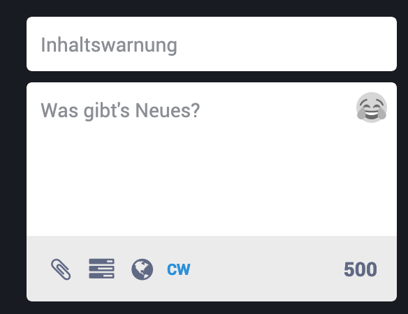
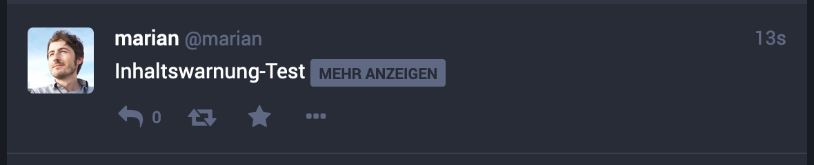

# Inhaltswarnung

**Hier lernst Du, wie Du heikle Inhalte hinter einer Warnung verbirgst.**

Ähnlich wie bei [Bildern und Videos](toots/media.md?id=medien-als-heikel-markieren) bietet Mastodon bei ganzen Beiträgen die Möglichkeit, zunächst eine Warnung anzuzeigen, die der/die Benutzer\*in anklicken muss, um den gesamten Inhalt des Beitrags anzuzeigen.

Die Funktion erreichst Du in der Web-Oberflächte über die mit `CW` für _Content Warning_ beschriftete Schaltfläche unterhalb des Eingabefeldes für Beiträge.

Nach dem Klick auf die Schaltfläche erscheint ein neues Eingabefeld oberhalb des Feldes für den Nachrichtentext, das mit _Inhaltswarnung_ beschriftet ist. In dieses Feld _kannst_ Du eine Überschrift bzw. die Warnung eingeben, die Nutzern zunächst angezeigt wird, wenn sie Deinen Beitrag sehen.

In den Zeitleisten anderer Nutzer\*innen wird ein solcher Toot so angezeigt wie auf dem nächsten Bild zu sehen.

Zunächst ist der Inhalt des Beitrags, einschließlich aller Bilder und Medien, verborgen. Erst durch Klick auf die Schaltfläche `MEHR ANZEIGEN` wird der gesamte Inhalt des Beitrags angezeigt.

**Hinweis zu unseren Regeln**: In unserem [Verhaltenskodex](https://gruene.social/about/more#codeofconduct) fordern wir alle Nutzer\*innen von GRUENE.SOCIAL dazu auf, gegebenenfalls von der Inhaltswarnung Gebrauch zu machen. Bitte weist andere Nutzer\*innen darauf hin, wenn Sie Eurer Meinung nach heikle Inhalte nicht markiert haben oder nicht von der Inhaltswarnung Gebrauch gemacht haben, wo es angemessen wäre. Wendet Euch an [@moderation](https://gruene.social/@moderation), wenn Ihr Unterstützung benötigt.
