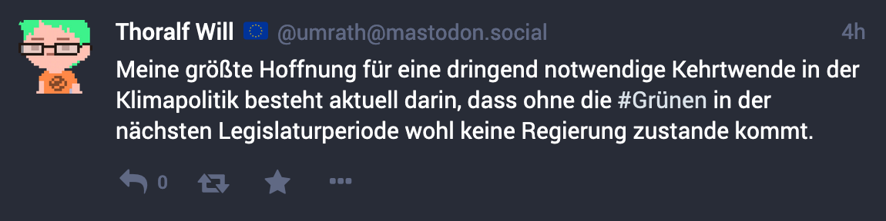

# Hashtags

**Hier erfährst Du, was ein Hashtag ist und was Du damit machen kannst.**

Hashtags sind Begriffe, die mit einem vorangestellten _Hash_-Zeichen (`#`) geschrieben werden. Diese werden von Mastodon als Hyperlinks dargestellt. Ein Klick auf einen solchen Hyperlink ermöglicht das Auffinden weiterer Toots, die diesen Hashtag enthalten.

Hashtags können ausschließlich aus den folgenden Zeichen bestehen:

- Buchstaben A bis Z bzw. a bis z
- Ziffern von 0 bis 9
- Umlaute und vergleichbare Unicode-Zeichen
- der Unterstrich `_`

Die Groß- und Kleinschreibung ist bei Hashtags nicht relevant. Wer Groß- und Kleinschreibung mischt, also beispielsweise `#FridaysForFuture` schreibt, macht damit den Hashtag allerdings leichter lesbar.

## Suche nach Hashtags

Die Suche nach Beiträgen, die durch Klick auf ein verlinktes Hashtag ausgelöst wird, erfasst alle Beiträge, die GRUENE.SOCIAL bekannt sind. Das sind in der Regel die Beiträge von Profilen, denen die Nutzer\*innen von GRUENE.SOCIAL folgen.

Das Suchergebnis einer solchen Hashtag-Suche verhält sich im Mastodon Web-Interface wie eine Zeitleiste (TODO: Link zur Erklärung). Neue, öffentliche Toots erscheinen darin automatisch, sobald sie veröffentlicht werden.
