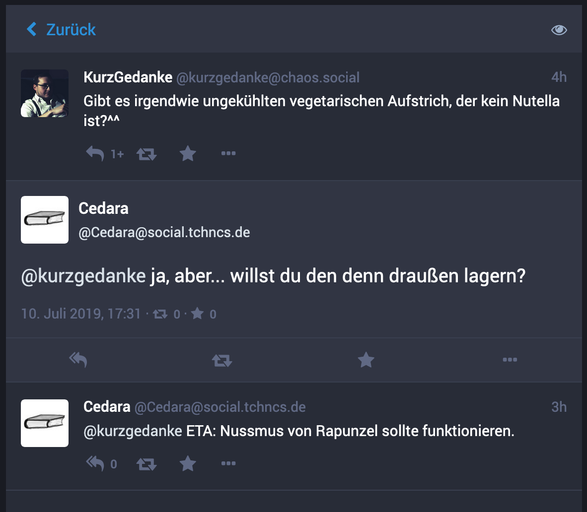

# Antworten und Threads

**Hier erfährst Du, was das besondere an einer Antwort ist und wie Du durch Verkettung von Antworten Threads erstellen kannst.**

## Die Anwort-Funktion

Die Mastodon Web-Oberfläche, aber auch die anderen [Apps und Clients](apps-clients.md), erlauben das direkte Antworten auf einen Toot mit einem Klick.

In der Web-Oberfläche ist das Symbol, das hierfür angeklickt werden muss, ein hakenförmiger Pfeil nach links und befindet sich unter dem Inhalt des Toots links. Neben diesem Pfeil wird auch die Anzahl der Antworten angezeigt, die der Toot bereits erhalten hat.

Durch den Klick ändert sich das Eingabefeld für das Verfassen eines Toots. Darüber wird der Inhalt des Toots, auf den man antwortet, noch einmal dargestellt. Im Eingabefeld selbst wird der Name eines oder mehrerer Benutzerprofile eingefügt.

Dahinter kannst Du nun den Antworttext eingeben, wie Du es bei einem normalen Beitrag tun würdest, und diesen veröffentlichen.

## Antwort vs. Erwähnung

Auch wenn eine Antwort so aussieht, als handele es sich dabei um einen Beitrag mit Erwähnung eines Benutzerprofils (oder mehrerer Benutzerprofile), so gibt es einen entscheidenden Unterschied:

ℹ️ **Wenn Du auf einen Toot antwortest, entsteht eine explizite Beziehung zwischen dem ursprünglichen Beitrag und Deiner Antwort.**

Wie oben bereits erwähnt, bekommen alle Nutzer\*innen im Zusammenhang mit einem Toot angezeigt, wie viele Antworten dazu es bereits gibt. Alle diese Antworten bekommst Du angezeigt, wenn Du die Detailseite des Toots aufrufst.

Die Abbildung oben zeigt die Detailansicht eines Toots, der selbst die Antwort auf einen anderen Toot ist, und noch eine weitere Anwort erhalten hat. Durch die Darstellung dieses Antwortverlaufs, oder engl. "Thread", kann eine Unterhaltung einfach nachvollzogen werden.

## Threads

Der Begriff _Thread_ (deutsch: Strang) steht in digitalen Kommunikationswerkzeugen für die Möglichkeit, einzelne Beiträge im Kontext der Beiträge, auf die diese sich beziehen, anzuzeigen. Es gibt diese Möglichkeit auch in vielen E-Mail-Programmen.

Auf Twitter, wo die Begrenzung der Länge eines einzelnen Betrags (Tweets) anfangs 140 Zeichen betrug, hat sich das Erstellen von Threads durch einzelne Nutzer als Möglichkeit etabliert, diese Längenbeschränkung zu umgehen. Nutzer\*innen antworten einfach auf ihre vorherige Nachricht und fügen damit die Fortsetzung eines Textes an.

Das kannst Du genau so auch auf Mastodon machen, indem Du nach dem Veröffentlichen eines Toots wie oben beschrieben die Anworten-Funktion zu Deinem eigenen Toot anklickst.