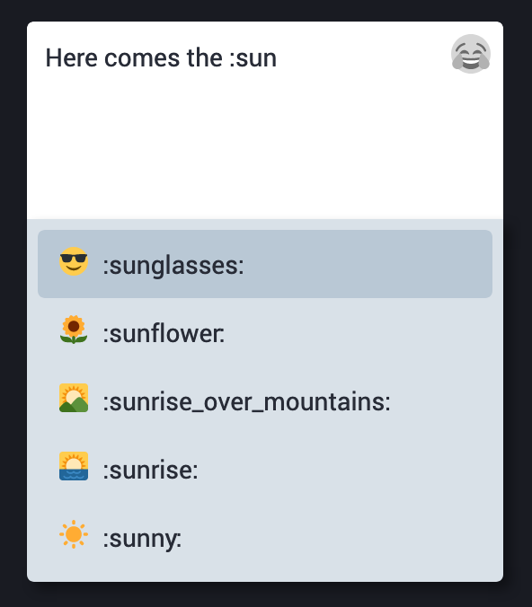

# Beitragstext

**Mastodon-Beiträge bzw. Toots können selbstverständlich Text beinhalten, müssen sie aber nicht. Hier erfährst Du, wie Du diesen eingibst, und wie Du Deinen Text um Emoji bereichern kannst.**

## Maximale Länge

Die Länge eines Beitrags ist auf **500 Zeichen** beschränkt. Bei der Eingabe in der Web-Oberfläche wird Dir angezeigt, wie viele Zeichen Du noch eingeben kannst, bis Du diese Grenze erreicht hast.

Damit ist der Anwendungszweck von Mastodon sicherlich auf gewisse Arten der Kommunikation beschränkt. Wer die Längenbeschränkung auf Mastodon überwinden möchte, muss mehrere Nachrichten in Folge absenden und sich dabei am besten per Antwort-Funktion jeweils auf die erste Nachricht beziehen.

## Emoji

[Emoji](https://de.wikipedia.org/wiki/Emoji) sind Symbole und Piktogramme, die in Text eingefügt werden können. Mastodon unterstützt Emoji ähnlich, wie man es schon von vielen Social-Media-Plattformen und Messengern kennt.

Zum Einfügen von Emoji in eine neue Nachricht gibt es ein Menü. Du kannst es über einen Klick auf das ausgegraute Smiley-Icon 😂 rechts oben im Eingabefeld für den Nachrichtentext öffnen.

Das Menü listet Dir alle verfügbaren Emoji auf. Durch Klick auf das jeweilige Emoji fügst Du es in den Nachrichtentext ein.

Das Menü ist nach **Kategorien** geordnet. Über die Icons am oberen Rand des Menüs kannst Du direkt zur jeweiligen Funktion wie zum Beispiel _Personen_, _Natur_ oder _Essen und Trinken_ springen.

Darüber hinaus kannst Du über eine englischsprachige **Suche** direkt nach Emoji suchen. Hier genügt auch die teilweise Eingabe eines Suchbegriffs. Gib zum Beispiel `sunf` ein, um das Sonnenblumen-Emoji (_sunflower_) zu finden.

### Emoji-Eingabe für Profis

Mastodon unterstützt die **Eingabe von Emoji direkt über die Tastatur**, ohne Benutzung des Menüs. Dazu musst Du zumindest ungefähr den Namen des Emoji, das Du einfügen willst, kennen. Um beispielsweise die Sonneblume in Deine Nachricht einzufügen, schreibst Du `:sunflower:`. Mastodon erleichtert Dir die Eingabe durch Anzeige eines Menüs zur Vervollständigung.

Dieses Menü findet, genau wie die Suche im Emoji-Menü, auch Teilbegriffe mitten im Emoji-Namen. Du kannst die Sonnenblume also beispielsweise auch finden, indem Du `:flow` eingibst und dann den richtigen Treffer auswählst.

Das Menü kannst Du selbstverständlich komplett über die Tastatur bedienen, so dass Du texte mit Emoji bequem eingeben kannst, ohne einmal die Hände von der Tastatur nehmen zu müssen.

## Eigene Emoji

Mastodon erlaubt es den Betreibern einer eigenen Instanz, die Emoji-Palette um eigene Bilder, Symbole und Piktogramme zu erweitern.

Wie Du im Screenshot weiter oben sehen kannst, gibt es im Menü dafür die Kategorie _Eigene_.

Viel Spaß damit!
