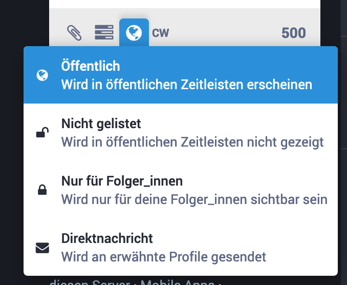

# Sichtbarkeit und Zielgruppen

**Hier erfährst Du, wie Du bestimmen kannst, wer Deine Beiträge bzw. Toots zu Gesicht bekommt und wer darauf Zugriff hat.**

Sofern Du es in Deinen [Profileinstlellungen](https://gruene.social/settings/preferences/other) nicht anderweitig eingestellt hast, ist jeder Toot, den Du absendest, automatisch für jede\*n sichtbar.

Beim Erstellen eines Beitrags bzw. Toots hast Du jedoch die Möglichkeit, die Sichtbarkeit für jeden Toot individuell zu beeinflussen.

⚠️ **Eine nachträgliche Änderung der Sichtbarkeit nach dem Absenden ist nicht möglich.** Hier hilft nur der Umweg über die Löschfunktion.

Die Optionen des Menüs werden in den nachfolgenden Abschnitten beschrieben.

## Öffentlich

Deine Follower können den Toot sehen. Dazu wird er anderen Nutzer\*innen, die nicht Deine Follwer sein müssen, in öffentlichen Zeitleisten angezeigt. Das bedeutet, er erscheint beispielsweise in der [Lokalen Zeitleiste](https://gruene.social/web/timelines/public/local) (alle Beiträge auf GRUENE.SOCIAL in chronologischer Folge) sowie in den föderierten Zeitleisten von Instanzen, die mit GRUENE.SOCIAL Beiträge austauschen.

## Nicht gelistet

Deine Follower können den Toot in ihren Zeitleisten sehen, andere Nutzer\*innen jedoch nicht. Trotzdem kann jede Nutzer\*in den Toot potentiell auf anderen Wegen finden.

## Nur für Folger_innen

Einen solchen Toot können nur Nutzer\*innen sehen, die Dir folgen. Sollte Nutzer\*in Dir folgen, nachdem der Beitrag abgesendet wurde, wird diese*r den Betrag ab dann auch sehen können.

Diese Einstellung könnte jedoch nützlich sein, wenn Du selbst bestimmst, wer Dir folgen darf.

## Direktnachricht

Nur die Nutzer\*innen, die Du in der Nachricht erwähnst, können die Nachricht sehen.

️️⚠️ **Warnung zu Direktnachrichten**

Da Nachrichten von Mastodon ja nicht nur an Mastodon-Accounts, sondern auch an Accounts auf anderen Plattformen gesendet werden können, ergibt sich ein mögliches Problem.

Wie [fediverse.party](https://fediverse.party/en/mastodon/) schreibt:
> Direct messages ("private messages") are delivered with limited visibility (non public) only between Mastodon users. Friends from other Fediverse networks may get such "direct messages" as public (visible to all) because some networks (GNU Social, postActiv) don't support DMs. Keep that in mind when sharing private information via a DM.

Falls Du vertrauliche Informationen über Direktnachrichten versenden möchtest, solltest Du Dir also sicher sein, dass die Nutzer\*innen, die Du anschreibst, ebenfalls Mastodon nutzen.
